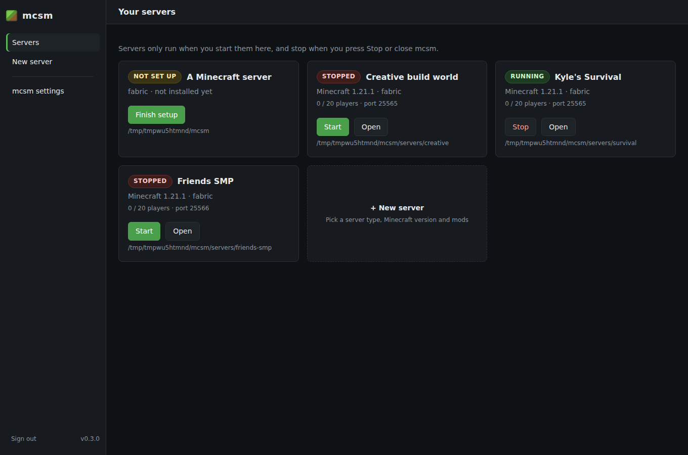
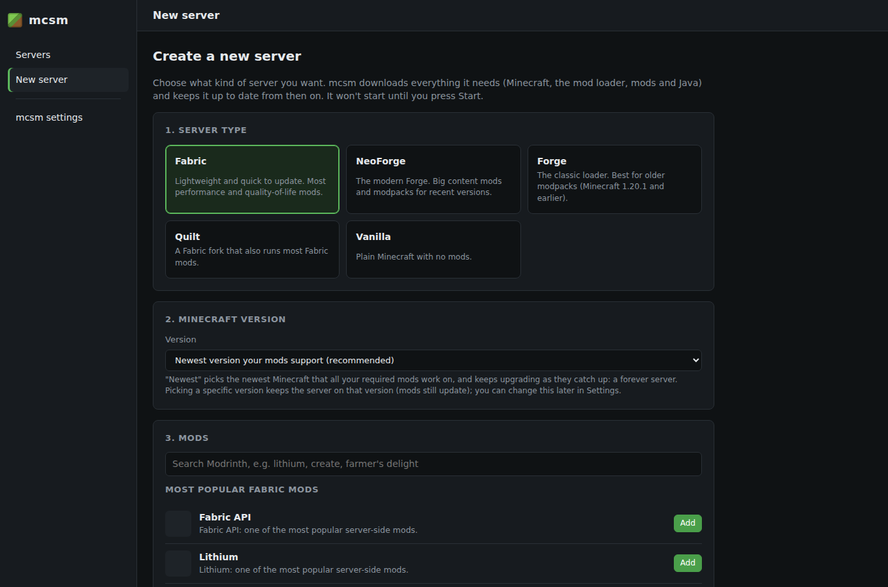
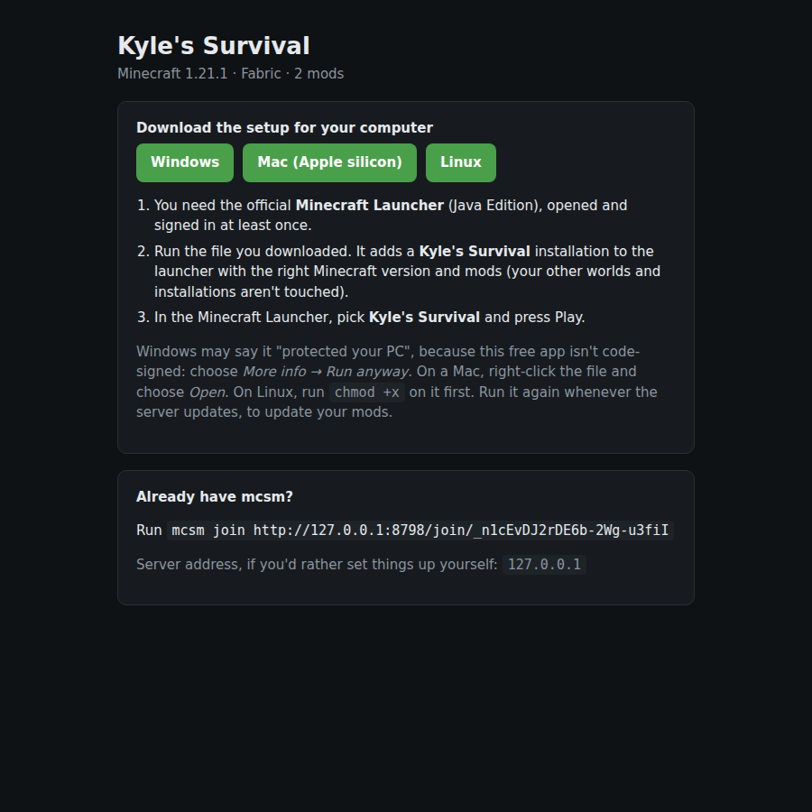
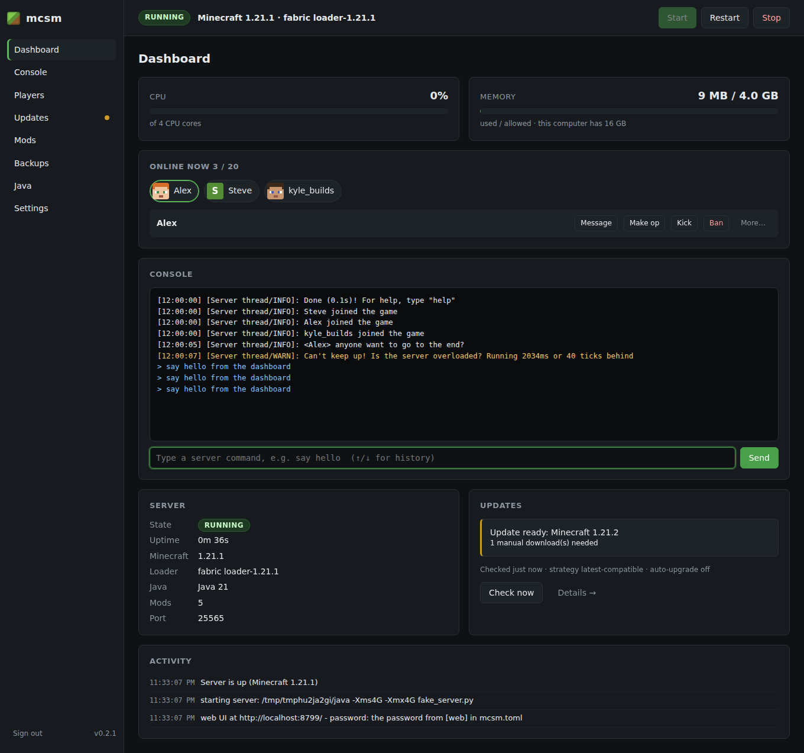
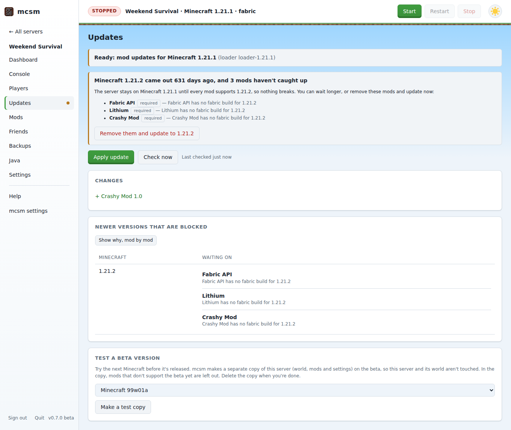
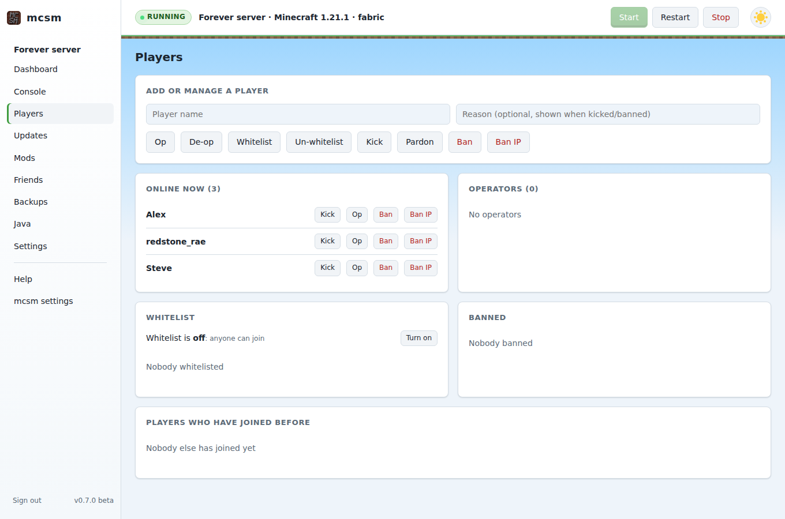

# mcsm: a forever Minecraft server

`mcsm` runs your modded Minecraft server and **keeps it on the newest Minecraft
release once your mods support it**. It watches for new releases and checks
whether your loader and every mod you depend on (plus their dependencies) have
builds for them. When they do, it counts down in-game, backs up, swaps
everything over, boots the new version to make sure it works, and
**rolls back automatically** if it doesn't.

It's one tool for both jobs: running the server (like autoMCS) and doing the
fragile upgrade pipeline you'd otherwise do by hand.

```
$ mcsm check
installed: Minecraft 1.21.4 / fabric 0.16.10 - latest release is 1.21.5

Minecraft 1.21.5 is blocked by:
  x Create Fabric: Create Fabric has no fabric build for 1.21.5

ready to update to Minecraft 1.21.4 with fabric 0.16.14:
  loader 0.16.10 -> 0.16.14
  ~ Lithium mc1.21.4-0.14.7 -> mc1.21.4-0.14.8
```

## Features

- **Upgrades only when your mods are ready.** Every release newer than the one you run is
  checked against the loader and each mod, and you move to the newest one where
  everything required is available. Mods marked `required = false` never hold an
  upgrade back: they're left out and reinstalled once they catch up.
- **Safe upgrades.** All downloads are fetched and hash-checked in a staging area
  *before* the server is touched. After a backup, the new version gets a verification
  boot. If it crashes or times out, the backup is restored, the old version is
  started again, and that exact combination isn't retried until something changes.
- **Keeps mods updated** within your current Minecraft version too.
- **Dependency resolution**: required dependencies are pulled in automatically, and
  client-only mods are skipped.
- **Loaders:** Fabric, Quilt, NeoForge, Forge (1.17+), and vanilla.
- **Mod sources:** Modrinth, and CurseForge (needs an API key).
- **Server supervisor** (`mcsm run`): restarts after crashes, gives in-game restart
  countdowns, can wait until nobody is online, passes console input through, and
  shuts down gracefully on SIGTERM.
- **Manages Java for you.** Each Minecraft version needs a particular Java version
  (1.20.5+ needs Java 21, 1.18–1.20.4 needs Java 17). mcsm picks the right one and
  downloads Eclipse Temurin into `.mcsm/java/` if you don't have it. You can also pin a
  version or keep runtimes patched with `mcsm java`.
- **Builds new servers from nothing:** `mcsm create` gives you a complete, test-booted server in one command.
- **Handles blocked CurseForge downloads.** When an author disallows third-party
  downloads, mcsm gives you the direct link to the file, then picks up and hash-checks
  the file once you drop it in `manual-downloads/`.
- **Player management:** kick, ban/pardon by name or IP, op/de-op and the whitelist,
  from the web UI or `mcsm player`, whether the server is running or stopped.
- **Web control panel:** dashboard, live console, players, one-click updates, mod search,
  uploads for blocked downloads, backups, Java and settings.
- **Discord notifications** for upgrades, blocked releases, crashes and rollbacks.
- **Leaves your files alone.** Only files mcsm installed (tracked in `mcsm.lock.json`)
  are ever replaced. World, configs and hand-added jars are never touched.
- No dependencies beyond Python 3.11+.

## What mcsm does and doesn't do

The first time you run it, mcsm shows these points and asks you to accept them, in
the terminal or in the web UI. Nothing runs until you do.

- mcsm runs your Minecraft server on this computer and keeps it and its mods up to date.
- It connects to the internet to download Minecraft, mod loaders, mods, Java and its
  own updates (from Mojang, Modrinth, CurseForge, Fabric, Quilt, NeoForge, Forge, Adoptium and GitHub).
- It does not collect usage data. There is no analytics, tracking, advertising or account.
- Your worlds, settings and backups stay on this computer. Nothing is uploaded, except
  messages to Discord if you set up a webhook.
- It changes files in your server folder: it replaces the mods and loader files it
  installed, and makes a backup first.
- Moving a world to a newer Minecraft version can't be undone. Restoring a backup is the only way back.
- Minecraft belongs to Mojang, and each mod belongs to its author. You accept Minecraft's EULA separately.
- This software was created with the help of AI (Anthropic's Claude). It is tested,
  but it may still have mistakes.
- It is free, open-source software (Apache 2.0 license), provided as is, with no warranty.
- Keep your own copies of anything you can't afford to lose.

For scripts, services and containers, accept it once with `mcsm notice --accept` or
pass `--accept-notice`. Under systemd, `mcsm run --web` waits and shows the notice in
the web UI. See [THIRD_PARTY_NOTICES.md](THIRD_PARTY_NOTICES.md) (or run
`mcsm licenses`) for every license involved.

## Download and run

Get the file for your computer from the
[latest release](https://github.com/silverWRX03/mc-server-management/releases/latest).
It's a single file: no installer, no Python, and no Java to set up (mcsm downloads the
right Java by itself).

| Your computer | Download |
|---|---|
| Windows 10/11 (64-bit) | [`mcsm-windows-x64.exe`](https://github.com/silverWRX03/mc-server-management/releases/latest/download/mcsm-windows-x64.exe) |
| Mac with Apple silicon (M1 or newer) | [`mcsm-macos-arm64`](https://github.com/silverWRX03/mc-server-management/releases/latest/download/mcsm-macos-arm64) |
| Linux, 64-bit Intel/AMD | [`mcsm-linux-x64`](https://github.com/silverWRX03/mc-server-management/releases/latest/download/mcsm-linux-x64) |
| Linux on ARM (Raspberry Pi 4/5 with a 64-bit OS) | [`mcsm-linux-arm64`](https://github.com/silverWRX03/mc-server-management/releases/latest/download/mcsm-linux-arm64) |

**Windows:** put `mcsm-windows-x64.exe` in a folder of its own (for example
`Documents\mcsm`) and double-click it.
- The first time, Windows SmartScreen may say *"Windows protected your PC"*, because
  the app isn't code-signed yet. Click **More info → Run anyway**.
- When the server first starts, allow it through Windows Firewall so friends can connect.

**Mac:** macOS blocks apps downloaded from the internet that aren't notarized, so run
these once in Terminal:

```sh
cd ~/Downloads
chmod +x mcsm-macos-arm64
xattr -d com.apple.quarantine mcsm-macos-arm64
./mcsm-macos-arm64
```

**Linux:** the Linux downloads run on practically any distribution from 2014 onward
(glibc 2.17 or newer: Ubuntu, Debian, Fedora, Rocky/Alma/RHEL 7+, Arch, openSUSE,
Raspberry Pi OS 64-bit, and so on). Alpine and other musl-based systems need the
[Python install](#with-python-instead) instead.

```sh
curl -LO https://github.com/silverWRX03/mc-server-management/releases/latest/download/mcsm-linux-x64
chmod +x mcsm-linux-x64
sudo mv mcsm-linux-x64 /usr/local/bin/mcsm     # optional: makes `mcsm` a command
mcsm
```

On a Raspberry Pi or another ARM machine, use `mcsm-linux-arm64` instead.

### What happens when you run it

1. Your browser opens mcsm's control panel. Sign in with `PASSWORD` (the eye button
   shows what you typed); you're then asked to choose your own password, a PIN, or no
   password (this computer only).
2. It shows [what mcsm does and doesn't do](#what-mcsm-does-and-doesnt-do) and asks you to accept.
3. **Your servers** lists every server you've made. Nothing starts by itself: press
   **Start** on the one you want to play, and **Stop** when you're done (closing mcsm
   stops them too). Several can run at once, each on its own port.
4. **New server** asks, one step at a time, for:
   - the server type: Fabric, NeoForge, Forge, Quilt or vanilla;
   - the Minecraft version: "newest" for a server that keeps upgrading itself, or a
     specific version to stay on;
   - mods (only for server types that run them): the 20 most popular are listed, or
     search Modrinth; each is marked required or optional;
   - the server name, players, difficulty, game mode, memory and port;
   - optionally, **Advanced settings**: world seed and type, PvP, spawn protection,
     view distance, whitelist, idle kicks, resource pack and the rest of
     `server.properties` (also on each server's Settings page later);
   - the Minecraft EULA.
5. **Create my server** downloads Java, the mod loader, Minecraft and your mods, checks
   that the server starts, and adds it to the list, ready for you to start. If a
   choice can't work, for example a mod that doesn't support the chosen version, the
   page says why so you can change it and try again.





Prefer the terminal? `mcsm setup` asks the same questions there.

Keep the mcsm window open while servers run, and press Ctrl+C (or close it) to stop
them all cleanly.

Servers live in a folder called `mcsm` in your home folder (`C:\Users\<you>\mcsm\servers\`
on Windows), one folder each. To keep them somewhere else, set the `MCSM_HOME`
environment variable. A folder that already contains an `mcsm.toml` (for example from
an older mcsm) shows up in the list too.

### Playing with friends

Switch on **Make a download for friends** when you create a server (or later, on the
server's **Friends** page) and share the invite link. Your friends:

1. open the link and download the setup for their computer (it's this same mcsm
   program, named after your server so it knows where to connect);
2. run it. It adds a *Your Server* installation to their **official Minecraft
   Launcher** with the right Minecraft version, mod loader (Fabric, Quilt, NeoForge or
   Forge) and mods, in a folder of its own, and puts your server in its multiplayer list;
3. pick that installation in the launcher and press Play. On Minecraft 1.20 and newer
   it joins your server straight away.

Mods come straight from Modrinth or CurseForge (every file is checked against its
checksum); only mods that run on players' computers are included, plus any
client-only mods you add on the Friends page (a minimap, JEI, Sodium...). When your
server upgrades, friends run the file again to update. Sign-in stays with the
Minecraft Launcher, so mcsm never sees anyone's Microsoft account.

For friends outside your home network, forward two TCP ports to this computer: your
Minecraft port (25565 for the first server) and the download port (8766), and enter
your public address under **mcsm settings → Sharing with friends**. The download port
serves only the invite page, the mod list and the download, never the control panel.
To play on the server from this computer too: `mcsm join --from-server <server folder>`.



**Deleting a server:** use **Delete** on its card, or **Delete server…** at the bottom
of its Settings. You choose whether to keep its files (it just leaves the list) or
erase its world, mods, backups and settings too (you type its name to confirm).

**Forgot the password?** On the server's own computer, the sign-in page has a
**Reset it to PASSWORD** link (or run `mcsm web-password --reset`).

**For friends outside your home network,** forward the server's port (25565 for the
first one; see its Settings) on your router to this computer.

**Verifying a download (optional):** every release includes `SHA256SUMS.txt`. Compare it with
`sha256sum mcsm-linux-x64` (Linux), `shasum -a 256 mcsm-macos-arm64` (Mac), or
`Get-FileHash mcsm-windows-x64.exe` (Windows PowerShell). The built-in updater checks this for you.

### With Python instead

If you have Python 3.11 or newer (for example on an Intel Mac, or anything not listed
above):

```sh
pipx install git+https://github.com/silverWRX03/mc-server-management
mcsm
```

### Linux servers (headless, over SSH)

- **Reaching the control panel from your own PC.** The setup wizard asks whether to
  allow other devices on your network; on a machine with no desktop the suggested
  answer is yes. mcsm then prints the address to open, such as
  `http://192.168.1.50:8765/`. If you'd rather keep it private to the server, answer
  no and use an SSH tunnel: `ssh -L 8765:localhost:8765 you@server`, then open
  <http://localhost:8765> on your PC. mcsm prints this command too.
- **Keeping it running after you log out, and after reboots:**

  ```sh
  mcsm service install      # sets up a systemd service for this server and starts it
  mcsm service status
  journalctl --user -u mcsm-<folder> -f    # the server console (`mcsm service install` prints the exact command)
  mcsm service uninstall
  ```

  As a normal user this creates a user service and enables "lingering" so it runs
  without anyone logged in (if that needs admin rights, mcsm prints the
  `sudo loginctl enable-linger` command). As root it creates a system service. A good
  setup is a dedicated `minecraft` user: `sudo -u minecraft mcsm service install`.
  [`examples/mcsm.service`](examples/mcsm.service) shows a hand-written unit if you prefer.
- **Firewall:** open the Minecraft port for players (`sudo ufw allow 25565/tcp`, or
  `sudo firewall-cmd --add-port=25565/tcp --permanent && sudo firewall-cmd --reload`),
  and port 8765 only if you use the control panel from other devices.

### Windows and macOS in the background

Keep the window open while the server runs. To start it automatically, add
`mcsm-windows-x64.exe` to Task Scheduler with the trigger *At log on*. On a Mac, add
it to *System Settings → General → Login Items*.

## Quick start: build a new server

One command downloads and builds everything: config, mods and their dependencies,
the loader, Java and `server.properties`. It then test-boots the server:

```sh
mcsm create ~/minecraft --loader fabric \
    --mod fabric-api --mod lithium --mod ferrite-core \
    --optional-mod create-fabric \
    --memory 6G --motd "Forever server" --rcon --accept-eula   # read https://aka.ms/MinecraftEULA first
cd ~/minecraft && mcsm run
```

`--minecraft` defaults to the newest release your mods support. Other options:
`--port`, `--max-players`, `--difficulty`, `--gamemode`, `--seed`, `--java`, `--curseforge ID`.

Or do the same thing step by step:

```sh
mkdir ~/minecraft && cd ~/minecraft
mcsm init --loader fabric --accept-eula     # read https://aka.ms/MinecraftEULA first
mcsm add fabric-api lithium ferrite-core    # Modrinth slugs
mcsm add create-fabric --optional           # don't hold upgrades back for this one
mcsm check                                  # what would be installed, what's blocking newer versions
mcsm update                                 # install it (and test-boot it)
mcsm run                                    # run it forever
```

## Migrating an existing server (e.g. from autoMCS)

Stop the server, then point mcsm at the existing directory and tell it which Minecraft
version the server currently runs:

```sh
cd ~/mcsm
mcsm init --server-dir /path/to/existing/server --loader fabric --minecraft 1.21.1
mcsm import        # identifies the jars in mods/ via Modrinth and adds them to mcsm.toml
mcsm check
mcsm update        # re-installs the loader through mcsm so it can manage it from now on
```

Jars that Modrinth doesn't recognise stay where they are and are reported as
*unmanaged*. Add CurseForge mods with `mcsm add --source curseforge <id>` and then
delete the old jar, or leave it unmanaged if the mod never needs updating.

## Web UI

```sh
mcsm run --web          # or set [web] enabled = true in mcsm.toml
mcsm web-password       # shows how the panel is protected (--set, --pin, --none, --reset)
```

Then open <http://localhost:8765>.



| Page | What you can do |
|---|---|
| **Dashboard** | CPU and memory bars; who's online, with head icons and one-click message / op / kick / ban; the server console with a command box; server state, update status, live activity feed |
| **Console** | live server log (warnings and errors highlighted), send commands with history |
| **Players** | who's online; kick, ban/pardon (by name or IP), op/de-op, whitelist on/off and add/remove; everyone who has joined before |
| **Updates** | check now, see exactly what would change, which mods block newer versions, apply with one click |
| **Mods** | search Modrinth for server-compatible mods and add them, add CurseForge mods, mark mods required/optional, remove them |
| **Backups** | back up now (with a proper `save-all`), restore any backup |
| **Java** | see which runtime the server uses, download Temurin versions, pin a version |
| **Settings** | update strategy, schedule, countdowns, memory, backups to keep, Discord webhook |

Mods whose authors block third-party downloads get a **Download** link and an
**Upload** button right on the Updates page. The uploaded file is checked against
CurseForge's checksum before it's accepted.



**Signing in.** The first password is `PASSWORD`, and the panel asks you to change
it right after you sign in. You can pick a password, a 4–8 digit PIN, or no password.
No password only works in a browser on the server's own computer; other devices
can't use the panel at all until you set a password or PIN again. Change it later
under Settings → Sign-in. Forgot it? Run `mcsm web-password --reset` on the server
to go back to `PASSWORD`. To fix the password in the config instead, set
`[web] password` in mcsm.toml. Passwords and PINs are stored only as salted hashes.

**Security.** By default it only listens on `127.0.0.1`. Every request needs a
login (rate limited; sessions are HttpOnly, SameSite=Strict cookies), and
changes need a CSRF header. Requests must address this machine by IP, `localhost`,
a `.local` name, or its host name, which blocks DNS-rebinding attacks. If you use a
reverse proxy with its own domain, add that domain to `[web] allowed_hosts`. The page runs under a strict Content Security Policy
with no third-party scripts. The console gives full operator control of your
server, so to reach it from elsewhere, put it behind an HTTPS reverse proxy (Caddy,
nginx) or a VPN such as Tailscale rather than exposing the port directly.

## Managing players

From the web UI's **Players** page, or the command line:

```sh
mcsm player list
mcsm player op Steve
mcsm player deop Steve
mcsm player kick Griefer --reason "cool it"
mcsm player ban Griefer --reason "griefing spawn"
mcsm player pardon Griefer
mcsm player ban-ip 203.0.113.9
mcsm player whitelist-on
mcsm player whitelist-add Alex
```

While the server runs, these are sent as the normal console commands (from the
command line this goes over RCON; the web UI doesn't need it). While it's stopped,
mcsm edits `ops.json`, `banned-players.json`, `banned-ips.json`, `whitelist.json`
and `server.properties` directly, and the changes apply when the server starts. For
that it looks up player UUIDs from `usercache.json` or Mojang, or computes the
offline UUID when `online-mode=false`. Kicking, and IP-banning by player name, need
the server running.



## Updating mcsm itself

mcsm checks its GitHub releases once a day; set `[mcsm] update_check = false` to turn
this off. When a new version is out:

- **Web UI:** a toast shows the new version and a link to what's new, with **Update
  now** and **Later** buttons. **Later** hides it until the next version comes out;
  **Settings → About → Check for mcsm updates** brings it back. **Update now**
  installs the release, warns players a minute ahead if anyone is online, stops the
  server cleanly, and restarts mcsm (and the server) on the new version. Then you
  sign in again.
- **Command line:** `mcsm self-update --check` shows what's new, and `mcsm self-update`
  installs it after asking. If `mcsm run` is managing a server, it hands the update to
  the daemon, which restarts itself.
- Nothing is ever installed without you accepting it.
- It installs with the same Python that runs mcsm (`pip install --upgrade
  git+https://github.com/silverWRX03/mc-server-management@<tag>`), so pip and pipx
  installs both work. A source checkout is updated with `git pull` instead.

The downloadable executables update themselves: mcsm downloads the new file for your
system from the release, checks it against `SHA256SUMS.txt`, and swaps it in. If
mcsm lives in a folder you can't write to, it tells you to download the new version
yourself.

## Mods that block third-party downloads

Some CurseForge authors don't allow tools to download their files. mcsm still finds
the right file for each Minecraft version, but a person has to download it:

```
$ mcsm check
...
manual download needed - these authors block automatic downloads.
download each file and put it in /home/me/minecraft/manual-downloads:
  -> Some Mod: somemod-1.21.4-2.3.jar
     https://www.curseforge.com/minecraft/mc-mods/some-mod/files/5550001
```

Open the link, download the file, drop it into `manual-downloads/` (or straight into
the server's `mods/`), and run `mcsm update` again. The file's hash is checked against
CurseForge, so a wrong or outdated file isn't used. The update never starts until
every file is present, so the server is never left half-upgraded. With `mcsm run`, the
same links go to your Discord notifications when a new version needs them.

## Java

By default (`[java] version = "auto"`) the server runs on the Java version that its
Minecraft version asks for. mcsm looks for it in this order:

1. that exact version in `[java.versions]`,
2. an mcsm-managed runtime in `.mcsm/java/`,
3. your system `java`, if it's exactly that version,
4. a fresh download of Eclipse Temurin (turn this off with `auto_install = false`).

| Command | What it does |
|---|---|
| `mcsm java list` | managed and configured runtimes, and which one the server uses |
| `mcsm java install 21 17` | download Temurin runtimes |
| `mcsm java update` | move managed runtimes to their newest patch release (server stopped) |
| `mcsm java use 21` | always run on Java 21 (must be at least what Minecraft needs) |
| `mcsm java use auto` | go back to following the Minecraft version |
| `mcsm java remove 17` | delete a managed runtime |

When a Minecraft upgrade needs a newer Java, it's downloaded during staging, before
the server is stopped.

## Running it forever

`mcsm run` is a foreground supervisor, so run it under systemd (see
[`examples/mcsm.service`](examples/mcsm.service)), tmux or screen. While it's running:

| Command | What it does |
|---|---|
| `mcsm update` | ask the running daemon to check and apply updates right now |
| `mcsm update --to 1.21.4` | ask it to move to one specific version |
| `mcsm cmd say hello` | send a console command over RCON (enable RCON in `server.properties`) |
| `mcsm status` | installed versions, mods, anything skipped, failed attempts |
| `mcsm stop` | stop the server gracefully and exit the daemon |
| `mcsm run --web` | same, plus the [web UI](#web-ui) |

When the server isn't running, `mcsm update` does the upgrade and a test boot itself.

## Configuration

`mcsm init` writes a commented `mcsm.toml`. The important parts:

```toml
[server]
loader = "fabric"
memory = "6G"

[updates]
strategy = "latest-compatible"   # or "latest" (wait for the newest release) or "mods-only"
mod_channel = "release"          # accept "beta"/"alpha" mod builds too
check_interval = "6h"
warn_minutes = [10, 5, 1]
wait_for_empty = false
verify_boot = true

[java]
version = "auto"                 # or force a major version, e.g. 21
auto_install = true              # download Temurin when the needed version is missing

[downloads]
manual_dir = "manual-downloads"  # drop blocked CurseForge files here

[notify]
discord_webhook = "https://discord.com/api/webhooks/..."

[[mods]]
source = "modrinth"
id = "lithium"
required = true
```

### Strategies

- **`latest-compatible`** (default): move to the newest release that everything supports,
  even if it isn't the very latest. For example, you might go 1.21.1 → 1.21.3 while
  a mod still lacks 1.21.4.
- **`latest`**: only ever jump straight to the newest release, once everything supports it.
- **`mods-only`**: pin the Minecraft version and just keep mods and the loader updated.

## How an upgrade works

1. **Plan:** for each candidate release, find the newest loader build and the newest
   acceptable file for every mod and dependency.
2. **Stage:** make sure any manual downloads are present, get the right Java, download
   everything into `.mcsm/staging/`, verify hashes, and run the loader installer. If anything fails here, the live server hasn't been touched.
3. **Warn and stop:** in-game countdown, then a graceful `stop`.
4. **Back up** the server directory to `backups/` (old backups are pruned).
5. **Swap:** remove the old managed mod jars and loader files, then move the new ones in.
6. **Verify:** boot the server and wait for `Done (…)!`.
7. **Commit or roll back:** on success, record the new state in `mcsm.lock.json`. On
   failure, restore the backup, restart the old version, and remember the failed
   combination.

> World upgrades are one-way: once a world has been opened in a newer Minecraft
> version, older versions can't load it. That's why every upgrade makes a full backup
> first. `mcsm restore` puts back the latest one (or a named one).

## Testing a build before a release

- **Test builds:** every CI run builds the Windows, macOS and Linux executables. Open
  the run under the repository's **Actions** tab (workflow **test**), scroll to
  **Artifacts**, and download `test-build-…` for your system. It's a zip containing the
  executable; you need to be signed in to GitHub.
- **Real end-to-end test:** the **e2e** workflow ([`packaging/e2e_test.py`](packaging/e2e_test.py))
  uses a built executable against the real services:
  - it creates real Fabric, NeoForge, Forge and vanilla servers with real Modrinth
    mods, downloads Java, and boots Minecraft;
  - it upgrades the Fabric server to the newest version its mods support;
  - it drives the web UI, RCON and player commands, then stops cleanly.

  It runs on Linux, plus Fabric on Windows and macOS, on every pull request and every
  Monday. You can also start it by hand under **Actions → e2e → Run workflow**.

## Releasing (for maintainers)

1. Set `__version__` in `src/mcsm/__init__.py`, e.g. `"0.2.0"`, and merge it to `main`.
2. Go to **Actions → release → Run workflow**, enter `0.2.0`, and run it. This creates
   the `v0.2.0` tag for you. Pushing the tag yourself works too:
   `git tag v0.2.0 && git push origin v0.2.0`.
3. The [release workflow](.github/workflows/release.yml) tests the code and builds the
   Windows, macOS and Linux executables with [PyInstaller](https://pyinstaller.org). It
   smoke-tests each one on its own OS, then publishes a GitHub release with the
   executables, the Python wheel, and `SHA256SUMS.txt`.
4. Running copies of mcsm notice the release within a day and offer to update.

To build an executable yourself:

- **Linux:** `packaging/build_linux.sh`. It uses a portable Python from
  [python-build-standalone](https://github.com/astral-sh/python-build-standalone), so
  the result runs on glibc 2.17+ and not just on your own distribution.
  `packaging/check_linux_compat.sh dist/mcsm` proves it in a CentOS 7 container.
- **Windows or macOS:** `pip install pyinstaller && pyinstaller packaging/mcsm.spec`.
- Then run `python packaging/smoke_test.py dist/mcsm` (or `dist/mcsm.exe`).

The executables aren't code-signed yet, which is why Windows and macOS show warnings.
Signing needs a Windows code-signing certificate and an Apple Developer ID
($99/year); both can be added to the release workflow later.

## Development

```sh
pip install -e ".[dev]"
pytest
```

The test suite runs the full install → upgrade → crash → rollback cycle against a fake
`java` and a fake server, so it needs no network and no Minecraft.

### Roadmap ideas

- Paper/Purpur plugin servers (Hangar/Modrinth plugins)
- Docker image


## License

Apache-2.0. See [LICENSE](LICENSE), and [THIRD_PARTY_NOTICES.md](THIRD_PARTY_NOTICES.md)
for the licenses of everything mcsm uses or downloads.
